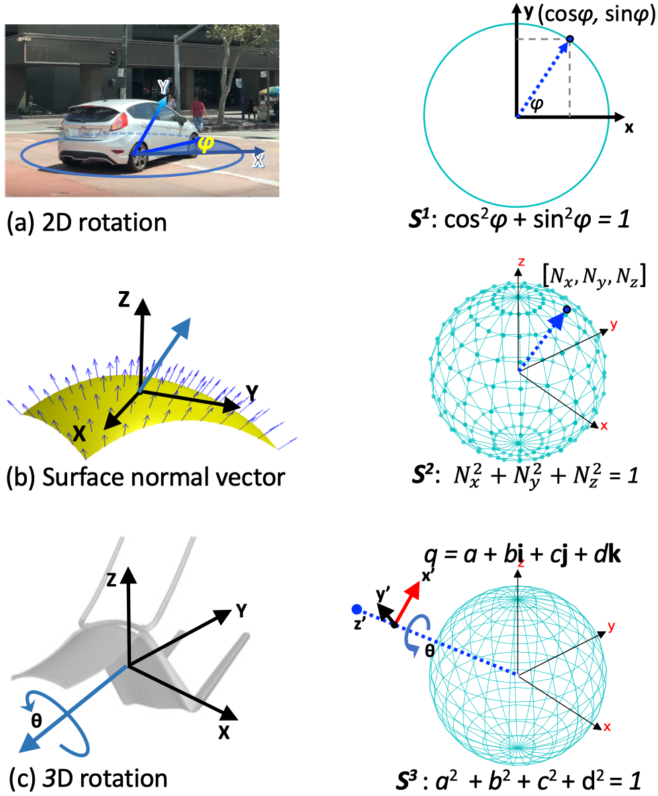
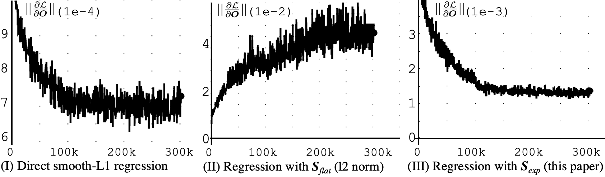
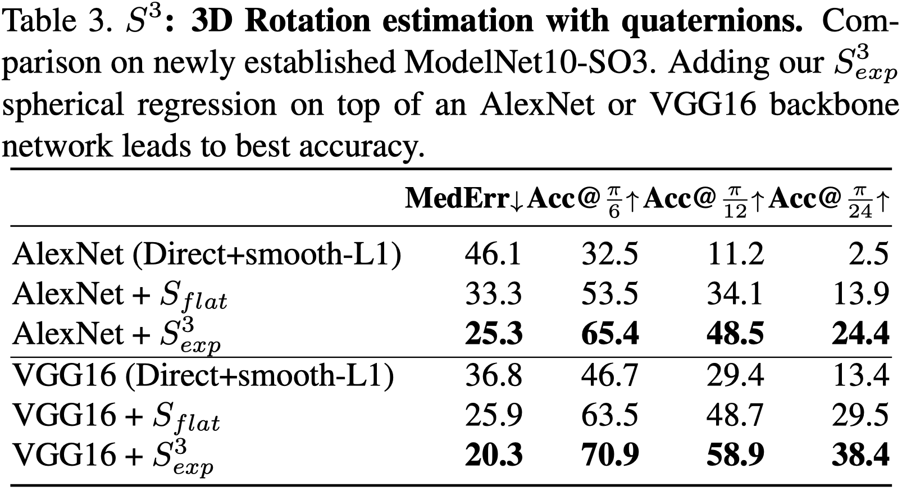
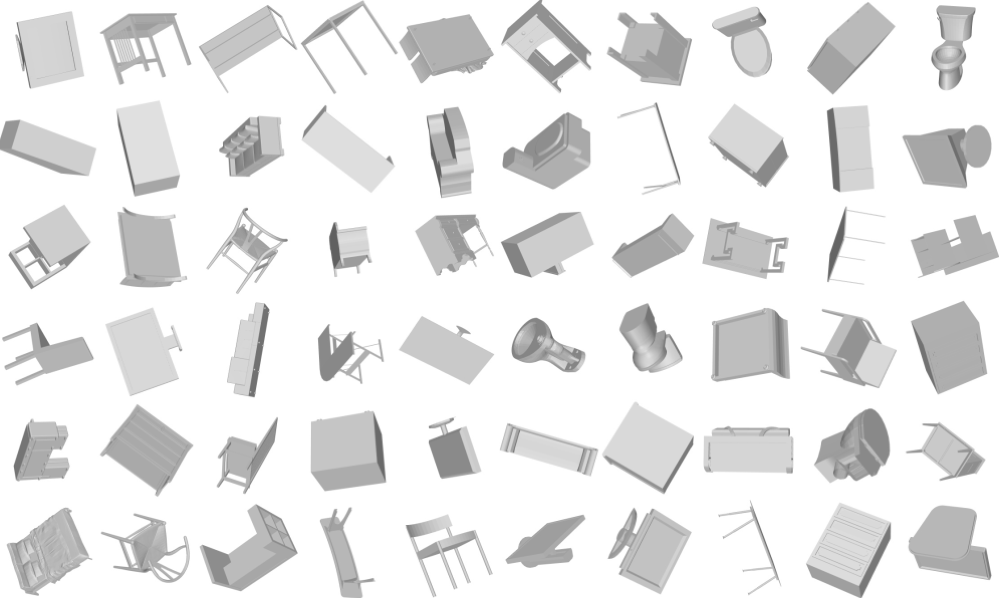
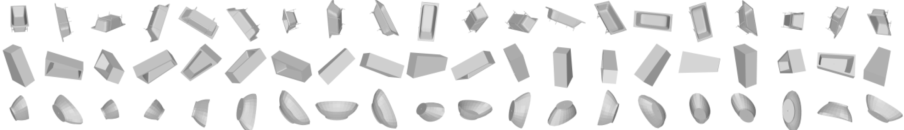

# Spherical_Regression


This code contains 3 parts:

- **Viewpoint Estimation**: S1.Viewpoint           [*]
- **Surface Normal Estimation**: S2.Surface_Normal [*]
- **3D rotation estimation** : S3.3D_Rotation

[*] To be cleaned up and released soon

You can find paper [here](http://arxiv.org/abs/1904.05404).
 

## What is Spherical regression?



Many computer vision problems can be converted into a $n$-sphere problem.
$n$-spheres are naturally closed geometric manifolds defined in the $\mathbb{R}^{(n+1)}$ space.
Examples are a) viewpoint estimation, b) surface normal estimation, and c) 3D rotation estimation.
This work proposes a general regression framework that can be applied on all these $n$-sphere problems.

<!-- -->

## Why use our $S_{exp}$ regression?

Having gradient constrained and leading to a stable training.


 

Variance of the average gradient norm $||\frac{\partial \mathcal L}{\partial \boldsymbol{O}}||$. Spherical exponentiation $\mathcal{S}_{exp}$ yields lower variance on mini-batch over entire train progress and thus leads to a better performance. 


<!--  -->

- (I)    Direct regression with smooth-L1 loss. It may cause the output to no longer follow unit $\ell_2$ norm.
- (II)   Regression with $\ell_2$ normalization $\mathcal{S}_{flat}$.
- (III)  Regression with $\mathcal{S}_{exp}$ (this paper).


 


## Dataset:

**ModelNet10-SO3** 

#### Rendering examples of rotatations. 


#### Example of uniformly sampled on SO3 (20 Views). 


- In lmdb format, and to be read by `pylibs/lmdb_util/imagedata_lmdb.py`
- [Download](https://drive.google.com/file/d/17GLZbNTDq8B_MOgrV1TiJPoqcm_oQ_mK/view?usp=sharing) (2.4G)

#### Visualize the dataset.

```
# Example
python pylibs/lmdb_util/imagedata_lmdb.py  path/to/ModelNet10-SO3/test_20V.Rawjpg.lmdb
```


### TODO
- Upload the caffe imagenet pretrain weights:  "pylibs/pytorch\_util/libtrain/init\_torch.py",
there's caffe_models.


## Citation

```
@INPROCEEDINGS{LiaoCVPR19, 
  author = {Shuai Liao and Efstratios Gavves and Cees G. M. Snoek}, 
  title = {Spherical Regression: Learning Viewpoints, Surface Normals and 3D Rotations on n-Spheres}, 
  booktitle = {Proceedings of the {IEEE} Conference on Computer Vision and Pattern Recognition}, 
  month = {June}, 
  year = {2019}, 
  address = {Long Beach, USA}, 
  pdf = {http://arxiv.org/abs/1904.05404}, 
  abstract = { Many computer vision challenges require continuous outputs, but tend to be solved by discrete classification. The reason is classification's natural containment within a probability n-simplex, as defined by the popular softmax activation function. Regular regression lacks such a closed geometry, leading to unstable training and convergence to suboptimal local minima. Starting from this insight we revisit regression in convolutional neural networks. We observe many continuous output problems in computer vision are naturally contained in closed geometrical manifolds, like the Euler angles in viewpoint estimation or the normals in surface normal estimation. A natural framework for posing such continuous output problems are n-spheres, which are naturally closed geometric manifolds defined in the R^{(n+1)} space. By introducing a spherical exponential mapping on n-spheres at the regression output, we obtain well-behaved gradients, leading to stable training. We show how our spherical regression can be utilized for several computer vision challenges, specifically viewpoint estimation, surface normal estimation and 3D rotation estimation. For all these problems our experiments demonstrate the benefit of spherical regression. All paper resources are available at https://github.com/leoshine/Spherical_Regression. }
}
```